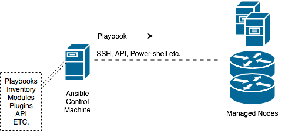

# **<p align="center">NETWORK AUTOMATION</p>**
# *<p align="center">with</p>*
# **<p align="center">ANSIBLE</p>**

---
# TABLE OF CONTENTS:
# Introduction
# Lab Setup
# What is Ansible
# Installation
# Ansible Concepts
# Basic Playbooks
# Automating Network Operations
# Acknowledgements
# Reference

---
# Introduction
## Objective
- To provide hands-on exposure to automating simple network operational tasks using basic Ansible features.

## Logistics
- This session is 2 hours long
- Lab will be available for you to use until Monday April 9th, 2018
- Use Spark room setup by Manish Sehgal for any questions.
- Most important: Note down your IP addresses **correctly**
  - Your Ansible server
  - IOS router mgmt IP
  - XR router mgmt IP
- Credentials are same across pods. If you use wrong IP addresses, you will end up working on others' pod.

---
# Lab Setup

The network topology used in this lab consists of the two Cisco routers and to a Ubuntu Server. The Ubuntu server will act as the Ansible Controller Machine and the Cisco Routers (IOSXE and IOS-XR) will be the network devices subjected to automation.
## Topology


## Lab access
- VPN access instructions are documented in the email that Manish Sehgal sent

### SSH into "your" Ansible server
- Your lab setup assignments are listed in the Smartsheet link that Manish sent.
- Use *putty* or some other ssh client
  - IP: `172.16.101.x`
  - User: `cisco`
  - Password: `cisco`
- Or, from Ubuntu/MAC terminal: `ssh -l cisco 172.16.101.x`

### Ping your routers from Ansible server
- From Ubuntu $ prompt, `ping <IOS router IP>`
- And, `ping <XR router IP>`
- You should be able to **ssh into Ubuntu server and ping R1 and R2** to advance to the next section.
- Review the section and discuss if you have any questions.
---

## What is Ansible
- Topology


- Ansible is a automation application software that can automate software provisioning, configuration management, and application deployment.
- 2 components:
  -  Ansible Control Machine or server: Ansible SW resides here.
  -  Network or server nodes: Devices that are being automated by Ansible.
- Ansible control machine communicates with nodes over ssh.
- Devices must be enabled for ssh access.
- Other than enabling SSH, there is no other requirement on network devices.

---

# Installation
- Ansible is preinstalled on your Ubuntu server. You need not install Ansible if you are not interested.
- Ansible Installation steps listed below, simple and easy steps similar to any linux package installation.


```
sudo apt-get update -y
sudo apt-get install software-properties-common -y
sudo apt-add-repository ppa:ansible/ansible -y
sudo apt-get update -y
sudo apt-get install ansible -y
```

### Sample output
```
cisco@server-1:~$ sudo apt-get update -y
Hit http://security.ubuntu.com trusty-security InRelease
:
Ign http://nova.clouds.archive.ubuntu.com trusty/universe Translation-en_US
Reading package lists... Done
.
cisco@server-1:~$ sudo apt-get install software-properties-common -y
Reading package lists... Done
:
0 upgraded, 0 newly installed, 0 to remove and 198 not upgraded.
.
cisco@server-1:~$ sudo apt-add-repository ppa:ansible/ansible -y
gpg: keyring `/tmp/tmprd8bbki9/secring.gpg' created
:
gpg:               imported: 1  (RSA: 1)
OK
.
cisco@server-1:~$ sudo apt-get update -y
Hit http://security.ubuntu.com trusty-security InRelease
:
Ign http://nova.clouds.archive.ubuntu.com trusty/universe Translation-en_US
Reading package lists... Done
.
cisco@server-1:~$ sudo apt-get install ansible -y
Reading package lists... Done
:
0 upgraded, 0 newly installed, 0 to remove and 198 not upgraded.
```

## Verification
- Verify Ansible installation. Execute the commands below:
  - `ansible --version`
  - `which ansible`
  - `ansible --help`

### Sample output
```
cisco@server-1:~$ ansible --version
ansible 2.4.3.0
  config file = /etc/ansible/ansible.cfg
:
  python version = 2.7.6 (default, Mar 22 2014, 22:59:56) [GCC 4.8.2]
.
cisco@server-1:~$ which ansible
/usr/bin/ansible
.
cisco@server-1:~$ ansible --help
Usage: ansible <host-pattern> [options]
:
Some modules do not make sense in Ad-Hoc (include, meta, etc)
cisco@server-1:~$
```

- Review the section and discuss if you have any questions.

---

# Ansible Concepts
- The following concepts are covered in this section:
  - Configuration file
  - inventory file
  - Modules
  - YAML
  - Playbooks

## Configuration file
- We can customize Ansible settings by editing the configuration file (ansible.cfg)
- There are advanced methods of tuning Ansible. In this session, we will focus on basic level.
- Other methods:
  - Non-default config file
  - Environmental settings
  - Command line options

> For research: different settings with explanation.
> - http://docs.ansible.com/ansible/latest/installation_guide/_config.html

### Edit configuration file
- Find Ansible config file
  - `ansible --version`
- Browse the config file and quickly go over different sections, denoted by [XXX]
- In this section, we will edit 4 settings:
  - inventory file name: (points to config file path)
  - retry file creation: (do not create retry file if playbook execution fails)
  - ssh host-key check: (do not check for ssh keys authentication)
  - ssh time-out: (set ssh timeout to 10 sec.)
- Read the config file and find the default settings for the above parameters
  - `grep inventory /etc/ansible/ansible.cfg`
  - `grep host_key /etc/ansible/ansible.cfg`
  - `grep timeout /etc/ansible/ansible.cfg`
  - `grep retry_files_enabled /etc/ansible/ansible.cfg`
- After editing the config file will look like below. The following output is for observation only; **do not copy/paste**.

```
[defaults]

inventory      = /etc/ansible/hosts

#Turn off ssh key checking so we are not prompted to accept the public key when logging in. In production environment, you should leave this enabled.
host_key_checking = False

#Turn set SSH Timeout to 10 Seconds
timeout = 10

#When Ansible has problems running plays against a host, it will output the name of the host into a file in the user’s home directory ending in ‘.retry’ but this file isn’t useful for us since we only have 3 hosts to work within this lab.
retry_files_enabled = False
```

- Config line for our parameters is commented. We will need to uncomment.
  - Delete # at the beginning of the line:
  - You may either edit the file **or** copy/paste the below command at $ prompt.
  - You can edit the file in many ways, such as "vi". Do it using your favorite method.
  - Below, it is done through "sed" command; If you prefer to follow the belwo "sed" method, simply copy/paste from Ubuntu $ prompt, on Ansible server.

```
sudo sed -i s/"#inventory      = \/etc\/ansible\/hosts"/"inventory      = \/etc\/ansible\/hosts"/g /etc/ansible/ansible.cfg

```

```
sudo sed -i s/"#host_key_checking = False"/"host_key_checking = False"/g /etc/ansible/ansible.cfg

```

```
sudo sed -i s/"#timeout = 10"/"timeout = 10"/g /etc/ansible/ansible.cfg

```

```
sudo sed -i s/"#retry_files_enabled = False"/"retry_files_enabled = False"/g /etc/ansible/ansible.cfg

```

- Verify that the lines is uncommented
  - `grep inventory /etc/ansible/ansible.cfg`
  - `grep host_key /etc/ansible/ansible.cfg`
  - `grep timeout /etc/ansible/ansible.cfg`
  - `grep retry_files_enabled /etc/ansible/ansible.cfg`

### Sample output
- If the above edits go smooth, you dont need to browse the below output.

```
  cisco@Ansible-Controller:~$ ansible --version
  ansible 2.4.2.0
    config file = /etc/ansible/ansible.cfg  <<<
    configured module search path = [u'/home/cisco/.ansible/plugins/modules', u'/usr/share/ansible/plugins/modules']
    ansible python module location = /usr/lib/python2.7/dist-packages/ansible
    executable location = /usr/bin/ansible
    python version = 2.7.6 (default, Oct 26 2016, 20:30:19) [GCC 4.8.4]
  .
  cisco@Ansible-Controller:~$ grep inventory /etc/ansible/ansible.cfg
  #inventory      = /etc/ansible/hosts  <<<
  # if inventory variables overlap, does the higher precedence one win
  :
  # If 'true' unparsed inventory sources become fatal errors, they are warnings otherwise.
  .
  cisco@Ansible-Controller:~$ sudo sed -i s/"#inventory      = \/etc\/ansible\/hosts"/"inventory      = \/etc\/ansible\/hosts"/g /etc/ansible/ansible.cfg
  .
  cisco@ansible-controller:~$ sudo sed -i s/"#retry_files_enabled = False"/"retry_files_enabled = False"/g /etc/ansible/ansible.cfg
  .
  cisco@ansible-controller:~$ sudo sed -i s/"#timeout = 10"/"timeout = 10"/g /etc/ansible/ansible.cfg
  .
  cisco@ansible-controller:~$ sudo sed -i s/"#host_key_checking = False"/"host_key_checking = False"/g /etc/ansible/ansible.cfg
  .

  cisco@Ansible-Controller:~$ grep inventory /etc/ansible/ansible.cfg
  inventory      = /etc/ansible/hosts <<<
  # if inventory variables overlap, does the higher precedence one win
  :
  # If 'true' unparsed inventory sources become fatal errors, they are warnings otherwise.
  cisco@Ansible-Controller:~$
  .
  cisco@ansible-controller:~$ grep "retry_files_enabled = False" /etc/ansible/ansible.cfg
  retry_files_enabled = False   <<<
  .
  cisco@ansible-controller:~$ grep "timeout = 10" /etc/ansible/ansible.cfg
  # gather_timeout = 10
  timeout = 10  <<<
  #command_timeout = 10
  .
  cisco@ansible-controller:~$ grep host_key /etc/ansible/ansible.cfg
  host_key_checking = False <<<
  #record_host_keys=False
  #host_key_auto_add = True
```

- Review the config file subsection and discuss if you have any questions.

## Inventory file
- Ansible can wotk on multiple devices at the same time.
- This is possible by listing several devices in the inventory file.
- We can have more than one inventory files. In this session, we will use only one inventory file.
- As per the config file that we editied above, our inventory file is: /etc/ansible/hosts
- We can organize devices into several groups.
- We can optionally, associate parameters to selected devices
- Structure:

```
[device-group-1]
IP-1
IP-2

[device-group-n]
IP-1
IP-3
IP-4

[superset-group-1:children]
[device-group-1]
[device-group-2]

[superset-group-2:children]
[device-group-3]
[device-group-n]

```
- You can add parameters in the inventory files, as follows

```
[device-group-1]
IP-1 ansible_user=cisco ansible_ssh_pass=cisco
IP-n

[device-group-n]
IP-1
IP-n ansible_user=cisco ansible_ssh_pass=cisco

[superset-group-1:children]
[device-group-1]
[device-group-2]

[superset-group-2:children]
[device-group-3]
[device-group-n]

```
### Edit inventory file
- Edit your default inventory file: /etc/ansible/hosts
- Find out your IOS and XR router mgmt IP addresses. Plug them in the file below.
- For editing, you may use your favorite method. Below one is just an example.
- Edit below text with correct IP addresses and copy/paste the text at Ubuntu $ prompt, to append to /etc/ansible/hosts file.
- Our entries are:

```
[IOS]
172.16.101.X ansible_user=cisco ansible_ssh_pass=cisco

[XR]
172.16.101.X ansible_user=cisco ansible_ssh_pass=cisco

[ALL:children]
IOS
XR
```


- This is one way of appending to the file /etc/ansible/hosts
- You may use "vi" or other favorite methods.
- Make sure that you replace X below, according to your address.

```
sudo tee -a /etc/ansible/hosts << EOF

[IOS]
172.16.101.X ansible_user=cisco ansible_ssh_pass=cisco

[XR]
172.16.101.X ansible_user=cisco ansible_ssh_pass=cisco

[ALL:children]
IOS
XR

EOF
```

### Verification
- Read the contents of inventory file and verify acuracy: `cat /etc/ansible/hosts`
- List inventory groups:

```
ansible --list-hosts IOS
ansible --list-hosts XR
ansible --list-hosts ALL
```

### Example output:

```
cisco@ansible-controller:~$ sudo tee -a /etc/ansible/hosts << EOF
>
> [IOS]
> 172.16.101.91 ansible_user=cisco ansible_ssh_pass=cisco
>
> [XR]
> 172.16.101.92 ansible_user=cisco ansible_ssh_pass=cisco
>
> [ALL:children]
> IOS
> XR
>
> EOF

[IOS]
172.16.101.91 ansible_user=cisco ansible_ssh_pass=cisco

[XR]
172.16.101.92 ansible_user=cisco ansible_ssh_pass=cisco

[ALL:children]
IOS
XR

cisco@ansible-controller:~$ tail -n 10 /etc/ansible/hosts
[IOS]
172.16.101.91 ansible_user=cisco ansible_ssh_pass=cisco

[XR]
172.16.101.92 ansible_user=cisco ansible_ssh_pass=cisco

[ALL:children]
IOS
XR

cisco@ansible-controller:~$ ansible --list-hosts IOS
  hosts (1):
    172.16.101.91
cisco@ansible-controller:~$ ansible --list-hosts XR
  hosts (1):
    172.16.101.92
cisco@ansible-controller:~$ ansible --list-hosts ALL
  hosts (2):
    172.16.101.91
    172.16.101.92
cisco@ansible-controller:~$
```

- Review the inventory subsection and discuss if you have any questions.


## Ansible Modules

- Modules are the nuts and bolts of Ansible automation tasks. Main operations on the devices are executed through modules.
- Ansible ships with a number of modules. Users can also write their own modules.
- Modules are Operating system specific. Target device should support the given Ansible module to carry out the operation.

> For future reference
> - Modules are also referred to as “task plugins” or “library plugins”
> - Modules can control system resources like services, packages, or files and handle executing system commands.
> - Detailed documentation is available at: http://docs.ansible.com/ansible/latest/modules.html
- Example module info: http://docs.ansible.com/ansible/latest/iosxr_command_module.html

### Overview
- List installed modules:
```
ansible-doc –l
ansible-doc -l | grep ios
ansible-doc -l | grep xr
```
- To satisfy your curiosity, let us play with a module in this subsection. We will use more modules later.

### Using "raw" module
- What is raw module: Executes a low-down and dirty SSH command, not going through the module subsystem
- We can execute commands on remote devices, using Ansible Raw module.
- Ensure your server has Raw module: `ansible-doc -l | grep raw`
- Detailed documentations: `ansible-doc raw`
- Sample output:

```
cisco@server-1:~$ ansible-doc -l | grep raw
raw                                       Executes a low-down and dirty SSH command

cisco@Ansible-Controller:~$ ansible-doc raw
```

- Syntax: `ansible <devices> -m raw -a <command> - u user-id -k`
  - -m = module name
  - -a = arguments
  - -u = username for router to authenticate
  - -k = prompt for password. Do not use ssh keys for authentication

### Examples
- Execute a command on your routers

```
ansible 172.16.101.91 -m raw -a "sho ip interface brief" -u cisco -k
```

- Execute a command on all routers in XR group
  - Remember that you created XR group in "inventory" subsection.

```
ansible XR -m raw -a "sho ip interface brief"
```
- Execute "show ip int br" on all routers

```
ansible ALL -m raw -a "sho ip interface brief" -u cisco -k
```
> - Detailed info on raw module is here: http://docs.ansible.com/ansible/latest/raw_module.html

- Review this subsection and discuss if you have any questions.


# YAML (rhymes with camel)
- Why are we talking about YAML: Ansible playbooks are written in YAML (YAML Ain't Markup Language), a data serialization language.
- YAML is meant to be human readable and intutive, making the playbooks easy to read and write.
- This section gives basic intro to YAML, good enough to do excericses in this session.
- There is more than one way of writing a given data. This can be a confusing factor.

> For more info, refer:
>  - http://docs.ansible.com/ansible/latest/YAMLSyntax.html
>  - http://www.yaml.org
>  - https://www.youtube.com/watch?v=cdLNKUoMc6c
>  - https://www.youtube.com/watch?v=U9_gfT0n_5Q

## YAML format
- Below are some content representations.
- Comments begin with number sign ( **#** )
- Space: Empty space is to be typed with "space-bar". Space with "Tab" key is invalid: `space` but `not tab`
  - Use "space bar key"
  - "tab key" indentation **won't work**
- String: wrapped in *single* or *double* quotes.
  - Example: `"sample string"` `'another sample string'`

- **Lists or arrays:** 
  - Lists are **ordered** data, meaning the order in which the items appear matter.
  - Lists are a sequence of items
  - Lists start with a - (hyphen+space).
  - All members of a list are lines beginning at the same indentation level.
  - Observe `hyphen` and `space hierarchy` in the below examples:

```
# List of Employees using Conventional Block Exmaple
  - Adam
  - John
  - Mary
  - Zach
```
```
# List of Employees using Indented Block Example
  - [Adam, John, Mary, Zach]
```
- **Dictionary:**
  - Dictionaries are a mapping of key with a value.
  - Set of properties of some data
  - Dictionaries are **unordered** data, meaning items can be defined in any order.
  - Space-hierarchy is important. See the below examples:
  - Key value pair:
    - Structure: (`key` `colon` `space` `value`)
    - key:` ` value
    - Examples:

```
# Indented Block Key Value Pair Example
  mountain: Everest
  river: "Colorado River"
  XR_Platform: CRS
```
```
# Inline Block Key Value Pair Example (use comma+space to separate key value pairs between braces)
  {mountain: Everest, river: "Colorado River", XR_Platform: CRS}
```

- **Merging Lists and Dictionaries:** 
  - More complicated data structures can be formed by merging lists and dictionaries. 
  - You can have lists in a dictionary and dictionaries in a list.
- Pay attention to `spaces` and `dashes` in the below examples:
  - List of 2 dictionaries (GigabitEthernet0 and GigabitEthernet1)

```
---
	#List of dictionaries - Interface config
	- GigabitEthernet0:
	    Description: connection to Server1
	    IP: 192.168.0.1
	    Subnet: 255.255.255.252
	    ACL:
	      - telnet-filter
	      - snmp-filter
	- GigabitEthernet1:
	    Description: connection to Server2
	    IP: 192.168.0.2
	    Subnet: 255.255.255.252
	    ACL:
	      - telnet-filter
	      - snmp-filter
```
- **Syntax Summary:**
  1.	Comments being with number sign ( # ); they can start anywhere on a line and continue until the end of the line.
  2.	Lists start with a leading hyphen ( - ) , with one member per line or enclosed in square brackets ( [ ] ) and separated by comma+space ( ,  ).
  3.	Dictionaries contain keys separated from values with a colon+space ( :  ) and can be one pair per line or enclosed in curly brackets ( { } ) and separate by comma+space ( ,  ). 


> Notes:
> - It is not super critical to remember all this. Most of this is obvious; so, don't sweat it.
> - It is possible to represent same data is multiple ways. This can be a confusing factor.
> - Syntax check tools are available.
>   - `ansible-playbook play-1.yml --syntax-check`
>   - https://codebeautify.org/yaml-validator
>   - http://www.yamllint.com

- Review the subsection and discuss if you have any questions.

## Playbooks
- Playbook is a method to execute multiple tasks on multiple groups of devices, intelligently, with one user-initiated command.
- Playbook is the main means of Ansible automation.
- Playbooks are written in YAML format.
- A "playbook" is a collection of plays.
- A playbook can have variables, parameters, loops, conditionals etc. to handle complex tasks.
- Playbook typically have exetension .yml or .yaml
- Playbook structure:
  - Playbook contains a list of plays.
  - Each "play", mainly has 2 sections: 1) play-level parameters and 2) one or more "tasks"
  - Each "tasks" section contains a list of modules.
  - Each "module" consists a list of actions (~commands).
  - All this is written in YAML format.
- Here is a typical structure:

```
---
Playbook level parameters

- name: play-1 description
  play-1-level parameters

  tasks:
    - name: task-1 description
      module-1
        action-1
        action-n

    - name: task-n description
      module-n
        action-1
        action-n

- name: play-n description
  play-n-level parameters
  tasks:
    - name: task-1 description
      module-1
        action-1
        action-n

    - name: task-n description
      module-n
        action-1
        action-n
```

- Copy the below contents into a file called p1.yml
- Use your favorite method to do this or use "sudo tee" as in the inventory section.


```
---
- name: play-1-output from IOS routers
  hosts: IOS
  gather_facts: no

  tasks:
    - raw:
        show ip route summary

      register: IOS_output

    - debug:
        var: IOS_output

- name: play-2-output from XR routers
  hosts: XR
  gather_facts: no

  tasks:
    - raw:
        show route summary

      register: XR_output

    - debug:
        var: XR_output
```

- The above playbook is same as the below in functionality; just another YAML representation.
- copy the below contents into a file and name it p2.yml


```
---
- name: play-1-output from IOS routers
  hosts: IOS
  gather_facts: no
  tasks:
    - raw: show ip route summary
      register: IOS_output
    - debug: var=IOS_output

- name: play-2-output from XR routers
  hosts: XR
  gather_facts: no
  tasks:
    - raw: show route summary
      register: XR_output
    - debug: var=XR_output
```

### Executing playbooks
- After creating the playbook, it can be executed using "`ansible-playbook`" command
- Execute the below:
  - `ansible-playbook p1.yml -u cisco -k`
  - `ansible-playbook p2.yml`
  - `ansible-playbook p1.yml --syntax-check`
  - `ansible-playbook p1.yml --check`
  - `ansible-playbook p1.yml --step`

> Quick read now, research later:
>
> "gather_facts: no"
> - By default, Ansible collects system information. This is not supported in our environment and hence disabled.
>
> "register"
> - Save the result in a variable. In this case, we are saving "show ip.." output in edge_output
> - Refer: http://docs.ansible.com/ansible/latest/playbooks_conditionals.html#register-variables
>
> "debug"
> - Debug module prints data
> - reference: http://docs.ansible.com/ansible/latest/debug_module.html

---

# Basic Playbooks
- Expected time to complete: 45mins
- This section has the following subsections:
  - Raw module
  - Variables (vars file)
  - Commands module (IOS and IOSXR)
  - Conditionals
  - Config module (IOS and IOSXR)
  - Loops
  - Interface module (IOS and IOSXR)

## Raw module
- Recall from earlier section, below is Ansible CLI using raw module:
  - `ansible XR -m raw -a "sho ip int br" -u gnaganab -k` (FYI only. need not execute)
  - In the below example, raw module is used in a playbook

### Example
- Display output of "show ip route summ" from all IOS routers
- Create a playbook file with the below contents and name it, raw-ios-route-summ.yml
- Execute the playbook with below CLI:
  - ansible-playbook ios_sh_ip_route_sum.yml --syntax-check
  - ansible-playbook ios_sh_ip_route_sum.yml -v

```
cisco@ansible-controller:~$ vi ios_sh_ip_route_sum.yml
---
- name: show ip route summary from IOS devices
  hosts: IOS
  gather_facts: false

  tasks:
    - name: exec CLI using raw module
      raw:
        sho ip route summary

      register: ios_output

    - debug:
        var: ios_output
```

## IOS and IOS_XR Commands modules
- Sends exec commands to remote device and returns the results.
- The module names are: **ios_command** and **iosxr_command**
- Like any other modules, these have "required" and "optional" parameters.
  - Required parameter examples: **commands**
  - Optional parameter examples: **retries**
- In this section, we will go over a basic level example.

> - Refer to http://docs.ansible.com/ansible/latest/modules/ios_command_module.html
- Don't forget to refer to documentation for your specific version
- `ansible-doc ios_command` Ansible inbuilt documentation
- IOS requires "enable" password to execute higher privilege privilage commands. The following parameters can be used for enable privilege.
  - `authorize: yes`

### Examples-1

```
cisco@ansible-controller:~$ vi ios_rtr_cfg.yml
---
- name: IOS Module Router Config
  hosts: IOS
  gather_facts: false
  connection: local

  tasks:
    - name: Collect Router Version and Config
      ios_command:   ##Using the ios_command module
         authorize: yes   ##authorize command instructs ansible to go to the privileged mode
         commands:
            - show version
            - show run

      register: value

    - debug: var=value.stdout_lines
```
### Examples-2
```
cisco@ansible-controller:~$ vi xr_rtr_cfg.yml
---
- name: XR Module Router Config
  hosts: XR
  gather_facts: false
  connection: local

  tasks:
    - name: Collect Router Version and Config
      iosxr_command:   ##Using the iosxr_command module
         commands:
            - show version
            - show ip int bri

      register: xr_output

    - debug: var=xr_output.stdout_lines
```

## Variables
- Variables are variables, to which we can assign values.
- Variables are defined in playbooks use "{{ }}" single/double quotes around double curly brackets
- Variable names should be letters, numbers, and underscores. Variables should always start with a letter.
  - Valid: `foo_port` or `foo5`
  - Invalid: `foo port` (no space) or `5foo` (no start with number) or `foo.port` (no dot) or `foo-port` (no dash)
- This is some most basic info. As you work through, you will learn more info.

### Examples

```
---
- name: play-1-output from IOS routers
  hosts: IOS
  gather_facts: false
  connection: local

  vars:
      host: "{{ ansible_host }}"
      username: "{{ ansible_user }}"
      password: "{{ ansible_ssh_pass }}"

```

## Conditionals
- It is possible to tie a **when** condition to a task and have it executed based on meeting a condition.
- We are going to cover "when" condition at basic level in this section.

> Notes:
> http://docs.ansible.com/ansible/latest/playbooks_conditionals.html

### Examples
```
cisco@ansible-controller:~$ vi ios-conditional-check.yml
---
- name: Verify Router is running IOS-XE
  hosts: IOS
  gather_facts: false
  connection: local

  tasks:
    - name: Collect Router Version
      ios_command:
         authorize: yes
         commands:
           - show version

      register: value

    - name: conditional task to verify if router is an IOS XE router
      debug:
        msg: " {{ inventory_hostname }} is an IOS XE Router."   #inventory_hostname is a global variable
      when: value.stdout | join('') | search('IOS XE')

```

## Loops
- Loop is used when a lot of actions are to be executed repeatedly.

```
cisco@ansible-controller:~$ vi ios-rtr-cfg-1.yml
---
- name: Backup IOS-XE Config
  hosts: IOS
  gather_facts: false
  connection: local

  tasks:
    - name: Collect Router Version and interface brief
      ios_command:
         authorize: yes
         commands: "{{ item }}"

      register: value

      with_items:
           - show version
           - show ip int bri

    - debug: var=value
```

## Config module (IOS and IOS XR)
- So far we have used raw and ios/xr_command modules to retrieve information from the router
- ios/xr_command modules are similar to ios/xr_config modules but are used to configure the router
- Config module uses parent and line options to structure the configuration in a heirarchical way
> - Refer: http://docs.ansible.com/ansible/latest/iosxr_config_module.html

### Examples

```
 tasks:
    - name: Configure Interface Setting
      iosxr_config:
        parents: "interface GigabitEthernet0/0/0/0"
        lines:
          - "description test"
          - "ip address 172.31.1.1 255.255.255.0"

```
Note: The same structure can be used for both ios_config.

---

# Automating Network Operations tasks

This section contains 4 exercises; in each exercise you will create Ansible playbooks to automate a certain network operations task.

   1. Configure OSPF on all Routers
   2. Automate router running-config backups
   3. Create snapshot tool
   4. Utilize Ansible-vault to encrypt sensitive files
---
## Exercise 1 - Configure OSPF on all routers

In the previous exercises you learned how to utilize ansible variables, conditionals, and loops to create a simple playbook. In this exercise you will take it a step further and create one playbook with multiple plays running against multiple hosts.
   * You will create a playbook to configure OSPF on both IOS and XR router
   * You will setup pre and post checks to ensure OSPF is working correctly

Use the below IOSXE and IOS-XR configurations to configure OSPF.
```
IOSXE OSPF Configuration:

router ospf 1
  router-id 192.168.0.1
  log-adjacency-changes
  passive-interface Loopback0
  network 192.168.0.1 0.0.0.0 area 0
  network 10.0.0.4 0.0.0.3 area 0

IOS-XR OSPF Configuration:

router ospf 1
 log adjacency changes
 router-id 192.168.0.2
 area 0
  interface Loopback0
   passive enable
  !
  interface GigabitEthernet0/0/0/0
   cost 100
  !
 !

```
**Step 1 -** Create a single YAML playbook to configure OSPF on both routers.

This playbook will contain multiple plays:
   * First play will configure OSPF on the IOS router
   * Second play will configure OSPF on the XR router
   * Third play will check if OSPF is working properly on both routers

In this step, setup 3 plays to be run on the respective hosts.

```
cisco@Ansible-Controller:~/project1$ vi multi-host-ospf-config.yml

---
- name: IOS OSPF CONFIG
  hosts: IOS
  gather_facts: false
  connection: local

  tasks:

- name: XR OSPF Config
  hosts: XR
  gather_facts: false
  connection: local

  tasks:

- name: Post-Check OSPF Config on all routers
  hosts: all
  gather_facts: false

  tasks:

```

**Step 2 -** Setup tasks under the IOSXE and IOS-XR plays to configure OSPF. Use OSPF configuration provided above.

```
cisco@Ansible-Controller:~/project1$ vi multi-host-ospf-config.yml

---
- name: IOS OSPF CONFIG

  tasks:
    - name: configure ospf in CSR1Kv
      ios_config:
          parents: "router ospf 1"
          lines:
            - "router-id 192.168.0.1"
            - "log-adjacency-changes"
            - "passive-interface Loopback0"
            - "network 192.168.0.1 0.0.0.0 area 0"
            - "network 10.0.0.4 0.0.0.3 area 0"

      register: iosxe_ospf_cfg

    - debug: var=iosxe_ospf_cfg

- name: XR OSPF Config

  tasks:
    - name: configure ospf in XRv
      iosxr_config:
        parents: "router ospf 1"
        lines:
          - "router-id 192.168.0.2"
          - " log adjacency changes"
          - "area 0"
          - "interface Loopback0"
          - "passive enable"
          - "exit"
          - "interface GigabitEthernet0/0/0/0 cost 1"
          - "exit"

      register: iosxr_ospf_cfg

    - debug: var=iosxr_ospf_cfg

```
**Step 3 -** Edit the playbook so that it only configures OSPF, if OSPF is not  already present on the router.

Setup a pre-check task which runs before the configure task to first check if OSPF is already configured on the router.

In order to accomplish this task, you will need to use the Ansible meta module. The meta task is a special kind of task which can directly influence the Ansible internal execution/state.

* Refer to [**Meta Module**](http://docs.ansible.com/ansible/latest/meta_module.html) document for more information on its parameter requirements.

In this step, you will use it as a conditional to end the play if OSPF is already configured and move to the next play.
```
cisco@Ansible-Controller:~/project1$ vi multi-host-ospf-config.yml

---
- name: IOS XE OSPF CONFIG

  tasks:
    - name: pre-check for ospf config
      ios_command:
        commands:
          - show run | be router ospf

      register: iosxe_ospf_pre

    - meta: end_play
      when: iosxe_ospf_pre.stdout | join('') | search('router ospf')

      - name: configure ospf in CSR1Kv

- name: XR OSPF Config
  hosts: XR
  gather_facts: false
  connection: local

  tasks:
    - name: pre-check for ospf config
      iosxr_command:
        commands:
          - show run | be ospf

      register: iosxr_ospf_pre

    - meta: end_play
      when: iosxr_ospf_pre.stdout | join('') | search('router ospf')

    - name: configure ospf in XRv

```

The conditional statement above takes the register value and concatenates it into a string which can then be searched for specific keywords. The meta module only gets executed if the when condition is true.

**Step 4 -** Setup a Post Check task to collect the "show ip route ospf" cli from both routers.

Note you will need to pause the execution of this task to allow for OSPF sessions to be established and routes to be exchanged.

```
cisco@Ansible-Controller:~/project1$ vi multi-host-ospf-config.yml

- name: Post-Check OSPF Config on all routers
  hosts: all
  gather_facts: false

  tasks:
    - pause: seconds=60   ##pause task execution for 60 seconds
    - name: post-check ospf config
      raw: "show ip route ospf"

      register: post_check

    - debug: var=post_check.stdout_lines

```
**Step 5 -** Check the ansible playbook for syntax errors and if no errors are present then execute the playbook.

```
cisco@Ansible-Controller:~/project1$ ansible-playbook multi-host-ospf-config.yml --syntax-check

playbook: multi-host-ospf-config.yml
cisco@Ansible-Controller:~/project1$ ansible-playbook multi-host-ospf-config.yml -v

```

Check the playbook execution to verify OSPF configuration was successful. Observe the post-check "show ip route ospf"output to verify OSPF routes are being exchanged between the two routers (check loopback ip).

---

## Exercise 2 - Automate router running-config backups

In this exercise, you will create a playbook to capture the running config from all nodes. Then you will setup a cron job to execute the playbook once a day and backup the router running-config files.

**Step 1 -** Create an ansible playbook with a single play which will collect "show run" output from all the nodes.

```
cisco@Ansible-Controller:~/project1$ vi rtr-cfg-bkup-1.yml

---
- name: Get Router Config from All Routers
  hosts: all
  gather_facts: no

  tasks:
    - name: Collect Show run from all routers
      raw: "show run"

      register: runcfg
```

Note when using the raw module do not set the connection to local. The raw module simply takes the input argument and executes the command on the remote host.

**Step 2 -** Edit the previous play to add a new task which will perform a time lookup. Then add another task to save the output to a file.

Use the set_fact option to set a variable "time" equal to the current time value on the server.
```
  tasks:
    - name: Collect Show run from all routers
      raw: "show run"

      register: runcfg

    - set_fact: time="{{lookup('pipe','date \"+%Y-%m-%d-%H-%M\"')}}"

    - name: save output to a file
      connection: local
      copy: content="\n ===show run=== \n {{ runcfg.stdout }}" dest="./{{ inventory_hostname }}_run_cfg_{{ time }}.txt"

```

Note when saving the output to a file you need to set the connection back to local since the output files need to be saved on the server itself.

**Step 3 -** Setup a cron on the Ansible Controller to execute the playbook once a day and backup the config files.

 You can test the cronjob by setting the execution time to run a one or two mins from the current to verify the job gets executed without errors.

 Execute the "date" command to get the current time on the server.

```
cisco@Ansible-Controller:~/project1$ date
Sun Feb 25 23:51:49 UTC 2018
cisco@Ansible-Controller:~/project1$

cisco@Ansible-Controller:~/project1$ sudo vi /etc/crontab

#Run Ansible Playbook rtr-cfg-bkup everyday at 5:15 am UTC to backup router configs

15 5 * * * cisco /usr/bin/ansible-playbook -i /etc/ansible/hosts  /home/cisco/rtr-cfg-bkup-1.yml

```
---
## Exercise 3 -  Create snapshot tool

In this exercise, you will create a snapshot tool (playbook) which will take two sets of captures, a pre and post capture, and compare the two files to find the differences. Commonly done during network maintenance windows.

There are 3 plays in this playbook:
    1. Collect Pre-Check Captures
    2. Collect Post-Check Captures
    3. Compare the two files

The first two plays are the mostly the same, with subtle variations to indicate where its a pre-capture or post-captures. The last play will perform the difference comparison and this is executed locally on the Ansible-Controller.

**Step 1 -** Create a YAML playbook with the first pre-check play to collect and save the following commands from the CSR router. Execute the playbook to create the Pre_Check_CSR.txt output file.

You can verify the contents of the Pre_check_CSR.txt file by using the more command. {ex: more Pre_check_CSR.txt}

CSR commands to collect:
   * show version | in Software,|uptime
   * show ip int bri
   * show ip route | be Gateway
   * show run

```
cisco@Ansible-Controller:~/project1$ vi iosxe-snapshot-tool.yml

---
- name: IOS XE Pre-Check Captures
  hosts: IOS
  gather_facts: false
  connection: local
  tags: pre_play

  tasks:
   - name: Collect Pre Check Commands
     ios_command:
        authorize: yes
        commands:
           - show version | in Software,|uptime
           - show ip int bri
           - show ip route | be Gateway
           - show run

     register: precheck

   - debug: var=precheck.stdout_lines

   - name: Save Pre Check output to a file
     copy:
      content="\n ===Pre-Show-Version=== \n\n {{ precheck.stdout[0] }} \n\n ===Pre-Show-Ip-Int-Brief==== \n\n {{ precheck.stdout[1] }} \n\n ===Pre-Show-Ip-Route=== \n\n {{ precheck.stdout[2] }} \n\n ===Pre-Show-Run=== \n\n {{ precheck.stdout[3] }} "
      dest="./Pre_check_ios.txt"
```

In this play you are setting a tag value "pre_play" as part of the pre-check play. Ansible allows tags to be added at the play or task level. When executing a playbook, you can select which plays or tasks to perform by listing the tag id as part of the --tags= syntax.

Ex: ansible-playbook iosxe-snapshot-tool.yml --tags=pre_play

**Step 2 -** Create a second play inside the previous iosxe-snapshot-tool playbook to collect and save the post-check commands (similar to pre-check play).

```
cisco@Ansible-Controller:~/project1$ vi iosxe-snapshot-tool.yml

- name: IOS XE Post-Check Captures
  hosts: IOS
  gather_facts: false
  connection: local
  tags: post_play

  tasks:
   - name: Collect Post Check Commands
     ios_command:
        authorize: yes
        commands:
           - show version | in Software,|uptime
           - show ip int bri
           - show ip route | be Gateway
           - show run

     register: postcheck

   - debug: var=postcheck.stdout_lines

   - name: Save Post Check output to a file
     copy:
      content="\n ===Post-Show-Version=== \n\n {{ postcheck.stdout[0] }} \n\n ===Post-Show-Ip-Int-Brief==== \n\n {{ postcheck.stdout[1] }} \n\n ===Post-Show-Ip-Route=== \n\n {{ postcheck.stdout[2] }} \n\n ===Post-Show-Run=== \n\n {{ postcheck.stdout[3] }} "
      dest="./Post_check_ios.txt"
```

**Step 3 -** Execute the snapshot tool playbook with just the 2nd play (post-check) to create the Post_check_CSR.txt output file.

You can verify the contents of the Post_check_CSR.txt file by using the more command. {more Post_check_CSR.txt}

```
cisco@Ansible-Controller:~/project1$ ansible-playbook iosxe-snapshot-tool.yml --tags=post_play
```

**Step 4 -** Edit the iosxe-snapshot-tool playbook again to create the final play which will compare the pre-capture and post-capture files. This play will be executed on the localhost, ansible-controller, and uses the shell and command modules to read the files and find the difference.

```
cisco@Ansible-Controller:~/project1$ vi iosxe-snapshot-tool.yml

- name: Check diff between pre- and post- files
  hosts: localhost
  tags: diff_play

  tasks:
   - name: Read Pre Capture File
     shell: cat ./Pre_check_ios.txt
     register: precheck

   - name: Read Post Capture File
     shell: cat ./Post_check_ios.txt
     register: postcheck

   - debug:
       msg: " Precheck is different than post-check"
     when:  precheck.stdout != postcheck.stdout

   - debug:
       msg: " Precheck is same as post-check"
     when: precheck.stdout == postcheck.stdout

   - name: Compare files
     command: >
        diff ./Pre_check_ios.txt ./Post_check_ios.txt
     register: difference
     failed_when: difference.rc > 1

   - debug: var=difference.stdout_lines

```

Diff cmd will show Failed status when the two files are different, this error code is not helpful as we rather know contents of the failure. Setting rc > 1 will allow task to complete without failed error code and allow us to capture the difference.

**Step 5 -** Execute just the 3rd play in snapshot tool playbook to perform the diff action and identify the differences between the pre-check and post-check files.

```
cisco@Ansible-Controller:~/project1$ ansible-playbook iosxe-snapshot-tool.yml --tags=diff_play
```

---
## Exercise 4 - Ansible Vault

Ansible Vault is an ansible feature that can be used to encrypt sensitive data such as passwords and keys. The command line tool "ansible-vault" can encrypt any structure data file used in Ansible, for example the inventory or variable files.

STEP1: Create an encrypted inventory file, using the ansible-vault create option.
```
cisco@Ansible-Controller:~/project1$ cat /etc/ansible/hosts | egrep -v ^#
cisco@ansible-controller:~$ cat /etc/ansible/hosts | egrep -v ^#
[IOS]
172.16.101.88 ansible_user=cisco ansible_ssh_pass=cisco

[XR]
172.16.101.89 ansible_user=cisco ansible_ssh_pass=cisco

[ALL:children]
IOS
XR

cisco@Ansible-Controller:~/project1$ ansible-vault create encrypt-inventory.txt {vault password - cisco123}
New Vault password:
Confirm New Vault password:

#Copy paste the contents of the inventory file into this vi editor.
```
STEP 2: Ensure file is encrypted by trying to view the contents of the encrypt-inventory.txt file.
```
cisco@Ansible-Controller:~/project1$ more encrypt-inventory.txt
$ANSIBLE_VAULT;1.1;AES256
30363964613235386263663039376435393237306163623230366561613863623031353439323233
3335383862316434616665326331316433343930663733320a336334373664376633336333333566
35663963336464393862316562666136343832396434363135643831306336343365343035643864
3563363463363731630a393634323631396133323964306632306561663064373730313962626265
33323434373865636361366563373762626363636664333139623133376363653434383061373564
66643436643232316232366637643337323032633536363637353865393634326262656239353038
33666265623034323366653130393035636235623766363639306463636630653538613937666130
38366431373266653962376566646133393266363337313534366533303666303430616636306330
35656164363562323565623730616264383234333636373430343261363861333136616630393331
61333261356164656366363633343263326465306664666431373531343862393365613934303637
33306663656236663136386561373538356330333134633166343666326537303733386131663966
64346232643537333535666332396663366664386465393133303432386334333866396662353438
62633863306664383539613236666333343264393032313035383136313465313365343031336262
31363439643465653165633239393231363939656435653964343034616439366166366663626230
653631343363316565376435636435376438
```
Use the Ansible-vault view option and provide the encrytpion password inorder to view contents of the encrypted file. Similarly  the ansible-vault edit option can be used to edit the encrypted file.
```
cisco@Ansible-Controller:~/project1$ ansible-vault view encrypt-inventory.txt
Vault password: cisco123
[IOS]
172.16.101.88 ansible_user=cisco ansible_ssh_pass=cisco

[XR]
172.16.101.89 ansible_user=cisco ansible_ssh_pass=cisco

[ALL:children]
IOS
XR

cisco@Ansible-Controller:~/project1$ ansible-vault edit encrypt-inventory.txt

```
STEP 3: Try to execute a playbook with the new encrypted inventory file. You have to specify the inventory file manually since this is not the default file listed inside ansible.cfg file.
```
cisco@Ansible-Controller:~/project1$ ansible-playbook -i encrypt-inventory.txt ios-rtr-cfg-1.yml
 [WARNING]:  * Failed to parse /home/cisco/project1/encrypt-inventory.txt with ini plugin: Attempting to decrypt but no vault secrets
found

 [WARNING]: Unable to parse /home/cisco/project1/encrypt-inventory.txt as an inventory source

 [WARNING]: No inventory was parsed, only implicit localhost is available

 [WARNING]: Could not match supplied host pattern, ignoring: all

 [WARNING]: provided hosts list is empty, only localhost is available

 [WARNING]: Could not match supplied host pattern, ignoring: csr


PLAY [Get Int IP address] *****************************************************************************************************************
skipping: no hosts matched

PLAY RECAP ********************************************************************************************************************************
```
Ansible was not able to execute the playbook because it was not able to decrypt the inventory file to identify the hosts.

In order to execute the playbook using an encyrpted inventory file you must enable the --ask-vault-pass option during playbook execution to prompt for decryption password.

STEP 4: Execute the playbook again using the —ask-vault-pass option and providing the vault password {cisco123}
```
cisco@Ansible-Controller:~/project1$ ansible-playbook -i encrypt-inventory.txt ios-rtr-cfg-1.yml --ask-vault-pass

```
STEP 5: Ansible can also encrypt or decrypt an existing file by using the "ansible-vault encrypt/decrypt <file>" opiton. Decrypt the "encrypt-inventory.txt" file you created in step 1.
```
cisco@Ansible-Controller:~/project1$ ansible-vault decrypt encrypt-inventory.txt
Vault password:
Decryption successful

cisco@Ansible-Controller:~/project1$ more encrypt-inventory.txt

```
---

# Acknowledgements
- A lot of material in this guide is sourced from [Ansible site](https://www.ansible.com)

---

# Reference
- [Ansible user guide](http://docs.ansible.com/ansible/latest/user_guide/index.html)
  - Single best resource for all basic Ansible documentation
- YAML resources
  - http://docs.ansible.com/ansible/latest/YAMLSyntax.html
  - http://www.yaml.org
  - https://www.youtube.com/watch?v=cdLNKUoMc6c
  - https://www.youtube.com/watch?v=U9_gfT0n_5Q
- Training
  - Ansible for the Absolute Beginner - Hands-On by Mumshad Mannambeth @Udemy [Click here](https://www.udemy.com/learn-ansible/learn/v4/overview)
  - Ansible for Network Engineers: Quick Start GNS3 & Ansible by David Bombal @Udemy [Click here](https://www.udemy.com/ansible-for-network-engineers-cisco-quick-start-gns3-ansible/learn/v4/overview)

---
