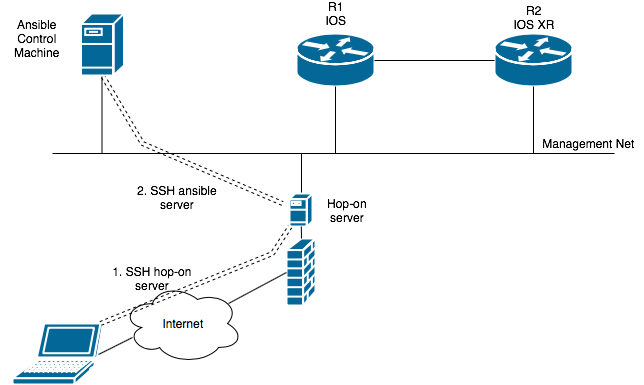

# **<p align="center">NETWORK AUTOMATION WITH ANSIBLE</p>**

---

# Introduction
# Lab Setup
# What is Ansible
# Installation
# Ansible Concepts
# Basic Playbooks
# Automating Network Operations
# Acknowledgements
# Reference

---
# Introduction
## Objective
- To provide hands-on exposure to automating simple network operational tasks using basic Ansible features.

## Participants' top-of-the-mind
- Participants' expectations from this session
- Any other top of the mind questions, comments, or prblems before we start the session

## Logistics
- This session is 2 hour long
- Lab will be available for you to use until **weekend. put date here**
- Best practice: have a partner to consult

---
# Lab Setup
- Estimated time to complete:

The network topology used in this lab consists of the tow Cisco routers and to a Ubuntu Server. The Ubuntu server will act as the Ansible Control Machine and the Cisco (IOSXE and IOS-XR) will be the network devices subjected to automation.
## Topology

## Lab access
- This is a hands-on section


### Connect to DMZ VPN using Cisco Anyconnect.
- Open Cisco Anyconnect app in your laptop
- Un-select "block connections to untrusted servers" in Anyconnect preferences
- Use the below details for VPN connection.
  - IP: `152.22.242.56`
  - Username: `cisco`
  - Password: `cisco.123`
  - Accept any security warnings.
- `ping 172.31.56.251` to very that VPN connection is successful


### SSH into Ubuntu server
- Use *putty* or someother ssh client
  - IP: `172.31.56.23X`
  - User: `labuser`
  - Password: `???`
  - Or, `ssh -l labuser 172.31.56.23X`
- From Ubuntu $ prompt, `ping r1`
- `ping r2`
- You should be able to **ssh into Ubuntu server and ping R1 and R2** to advance to the next section.
- Review the section and discuss if you have any questions.

---

## What is Ansible
- Estimated time to complete:
- Topology


- Ansible is a automation application software that can automate software provisioning, configuration management, and application deployment.
- 2 components:
  -  Ansible Controll Machine or server: Ansible SW resides here.
  -  Network or server nodes: Devices that are being automated by Ansible.
- Ansible control machine communicates with nodes over ssh. Hence, devices must be enabled for ssh access. Other than SSH, there is no other requirement on network devices.
- Ansible has several components, which we are going touch soon. Review the topology diagram above.
- Review the section and discuss if you have any questions

> Notes:
> - For future reference, refer to [**Slides**](https://wwwin-github.cisco.com/gtamilse/ansible-lab/blob/master/Ansible-Overview-v1.pdf)
> - These slides cover Ansible Introduction and syntax.

---

# Installation
- Estimated time to complete:
- This step is to be executed from your Ansible server. Make sure that you are on the right server. Below commands may help.
  - `ifconfig eth0`
- Install Ansible by executing the below commands on Ubuntu server, in sequence.
```
sudo apt-get update -y
sudo apt-get install software-properties-common -y
sudo apt-add-repository ppa:ansible/ansible -y
sudo apt-get update -y
sudo apt-get install ansible -y
```

### Sample output
```
cisco@server-1:~$ sudo apt-get update -y
Hit http://security.ubuntu.com trusty-security InRelease
:
Ign http://nova.clouds.archive.ubuntu.com trusty/universe Translation-en_US
Reading package lists... Done
.
cisco@server-1:~$ sudo apt-get install software-properties-common -y
Reading package lists... Done
:
0 upgraded, 0 newly installed, 0 to remove and 198 not upgraded.
.
cisco@server-1:~$ sudo apt-add-repository ppa:ansible/ansible -y
gpg: keyring `/tmp/tmprd8bbki9/secring.gpg' created
:
gpg:               imported: 1  (RSA: 1)
OK
.
cisco@server-1:~$ sudo apt-get update -y
Hit http://security.ubuntu.com trusty-security InRelease
:
Ign http://nova.clouds.archive.ubuntu.com trusty/universe Translation-en_US
Reading package lists... Done
.
cisco@server-1:~$ sudo apt-get install ansible -y
Reading package lists... Done
:
0 upgraded, 0 newly installed, 0 to remove and 198 not upgraded.
```

## Verification
- Verify Ansible installation. The below commands may help:
  - `ansible --version`
  - `which ansible`
  - `ansible --help`

### Sample output
```
cisco@server-1:~$ ansible --version
ansible 2.4.3.0
  config file = /etc/ansible/ansible.cfg
:
  python version = 2.7.6 (default, Mar 22 2014, 22:59:56) [GCC 4.8.2]
.
cisco@server-1:~$ which ansible
/usr/bin/ansible
.
cisco@server-1:~$ ansible --help
Usage: ansible <host-pattern> [options]
:
Some modules do not make sense in Ad-Hoc (include, meta, etc)
cisco@server-1:~$
```

- Review the section and discuss if you have any questions.

---
# Ansible Concepts
## Inventory file
- Ansible can work on multiple devices at the same time.
- It reads the device IP addresses from inventory file.
- Many features can be imbibed in the config file: we can group the devices, we can specify device-specific parameters etc.
- In the next steps, we will edit the default invenotry file.

### Edit configuration file
- Find Ansible config file
  - `ansible --version`
- Read the config file and find the inventory file path
  - `grep inventory /etc/ansible/ansible.cfg`
- If the config line for inventory is commented, uncomment it.
  - Delete # at the beginning of the line: you may either edit the file or copy/paste the below command at $ prompt.
  - `sudo sed -i s/"#inventory      = \/etc\/ansible\/hosts"/"inventory      = \/etc\/ansible\/hosts"/g /etc/ansible/ansible.cfg`
- Verify that the line is uncommented
  - `grep inventory /etc/ansible/ansible.cfg`

### Example output
```
cisco@Ansible-Controller:~$ ansible --version
ansible 2.4.2.0
  config file = /etc/ansible/ansible.cfg
  configured module search path = [u'/home/cisco/.ansible/plugins/modules', u'/usr/share/ansible/plugins/modules']
  ansible python module location = /usr/lib/python2.7/dist-packages/ansible
  executable location = /usr/bin/ansible
  python version = 2.7.6 (default, Oct 26 2016, 20:30:19) [GCC 4.8.4]
.
cisco@Ansible-Controller:~$ grep inventory /etc/ansible/ansible.cfg
#inventory      = /etc/ansible/hosts
# if inventory variables overlap, does the higher precedence one win
#inventory_plugins  = /usr/share/ansible/plugins/inventory
# These values may be set per host via the ansible_module_compression inventory
# Controls which files to ignore when using a directory as inventory with
#inventory_ignore_extensions = ~, .orig, .bak, .ini, .cfg, .retry, .pyc, .pyo
[inventory]
# enable inventory plugins, default: 'host_list', 'script', 'yaml', 'ini'
# ignore these extensions when parsing a directory as inventory source
# ignore files matching these patterns when parsing a directory as inventory source
# If 'true' unparsed inventory sources become fatal errors, they are warnings otherwise.
.
cisco@Ansible-Controller:~$ sudo sed -i s/"#inventory      = \/etc\/ansible\/hosts"/"inventory      = \/etc\/ansible\/hosts"/g /etc/ansible/ansible.cfg
.
cisco@Ansible-Controller:~$ grep inventory /etc/ansible/ansible.cfg
inventory      = /etc/ansible/hosts
# if inventory variables overlap, does the higher precedence one win
#inventory_plugins  = /usr/share/ansible/plugins/inventory
# These values may be set per host via the ansible_module_compression inventory
# Controls which files to ignore when using a directory as inventory with
#inventory_ignore_extensions = ~, .orig, .bak, .ini, .cfg, .retry, .pyc, .pyo
[inventory]
# enable inventory plugins, default: 'host_list', 'script', 'yaml', 'ini'
# ignore these extensions when parsing a directory as inventory source
# ignore files matching these patterns when parsing a directory as inventory source
# If 'true' unparsed inventory sources become fatal errors, they are warnings otherwise.
cisco@Ansible-Controller:~$
```

### Edit inventory file
- As an example, let us have two groups: IOS and XR
- Find out your IOS and XR router mgmt IP addresses
- Edit your default inventory file as follows:

```
sudo tee -a /etc/ansible/hosts << EOF

[IOS]
10.10.10.4

[XR]
10.10.10.3

[ALL:children]
IOS
XR

EOF
```
- The group names used-IOS, XR, ALL- are just name tags.
- In this example, we have just one router in each group. We can have multiple routers in a group.
- The group, "ALL" is a mother group, that its constituents are other groups.

### Verification
- Read the contents of inventory file and verify acuracy: `cat /etc/ansible/hosts`
- List inventory groups:

```
ansible --list-hosts IOS
ansible --list-hosts XR
ansible --list-hosts ALL
```

### Example output:

```
cisco@server-1:~$ ansible --list-hosts edge
  hosts (1):
    10.10.10.4
cisco@server-1:~$ ansible --list-hosts core
  hosts (1):
    10.10.10.3
cisco@server-1:~$ ansible --list-hosts all
  hosts (2):
    10.10.10.3
    10.10.10.4
cisco@server-1:~$
```
- Review the inventory subsection and discuss if you have any questions.

---

## Ansible Modules

- Modules are the nuts and bolts of Ansible automation tasks. Main operations on the devices are executed through modules.
- Ansible ships with a number of modules. Users can also write their own modules.
- Modules are Operating system specific. Target device should support the given Ansible module to carryout the operation.

> For future reference
> - Modules are also referred to as “task plugins” or “library plugins”
> - Modules can control system resources like services, packages, or files and handle executing system commands.
> - Detailed documentation is available at: http://docs.ansible.com/ansible/latest/modules.html
- Example module info: http://docs.ansible.com/ansible/latest/iosxr_command_module.html

### Overview
- List installed modules:
```
ansible-doc –l
ansible-doc -l | grep ios
ansible-doc -l | grep xr
```
- To satisfy your curiousity, let us play with a module in this subsection. We will use more modules later.

### Using "raw" module
- What is raw module: Executes a low-down and dirty SSH command, not going through the module subsystem
- We can execute commands on remote devices, using Ansible Raw module.

```
cisco@server-1:~$ ansible-doc -l | grep raw
raw                                       Executes a low-down and dirty SSH command

cisco@Ansible-Controller:~$ ansible-doc raw
```

- Syntax: `ansible <devices> -m raw -a <command> - u user-id -k`
  - -m = module name
  - -a = arguments
  - -u = username for router to authenticate
  - -k = prompt for password. Do not use ssh keys for authentication

### Examples
- Execute a command on 172.16.101.32

```
ansible 172.16.101.32 -m raw -a "sho ip interface brief" -u cisco -k
```

- Execute a command on all routers in XR group
  - Remember that you created XR group in "inventory" subsection.

```
ansible XR -m raw -a "sho ip interface brief" -u cisco -k
```
- Execute "show ip int br" on all routers

```
ansible ALL -m raw -a "sho ip interface brief" -u cisco -k
```
> - Detailed info on raw module is here: http://docs.ansible.com/ansible/latest/raw_module.html

- Review this subsection and discuss if you have any questions.

---

# YAML (rhymes with camel)
- Estimated time to complete this section:


## Overview
- Why are we talking about YAML: Ansible playbooks are written in YAML (YAML Ain't Markup Language), a data serialization language.
- YAML is meant to be human readable and intutive, making the playbooks easy to read and write.
- This section gives basic intro to YAML, good enough to do excericses in this session.
- There are more than one way of writing a given data. This can be a confusing factor.

> For more info, refer:
  - http://docs.ansible.com/ansible/latest/YAMLSyntax.html
  - http://www.yaml.org
  - https://www.youtube.com/watch?v=cdLNKUoMc6c
  - https://www.youtube.com/watch?v=U9_gfT0n_5Q

## YAML format
- Below are some content representations.
- Space: Empty space is to be typed with "space-bar". Space with "Tab" key is invalid: `space` but `not tab`
  - Use "space bar key"
  - "tab key" indentation **won't work**
- String: wrapped in *single* or *double* quotes.
  - Example: `"sample string"` `'another sample string'`
- Key value pair:
  - Structure: (`key` `colon` `space` `value`)
  - key:` ` value
  - Examples:

```
mountain: Everest
river: "Colorado River"
XR_Platform: CRS
```
-  Lists or arrays:
  - Lists are **ordered** data.
  - The list will have a different effect if the order is changed
  - Lists start with a - (dash).
  - Observe `dash` and `space hierarchy` in the below examples:

```
  - eagle
  - rattlesnake
  - frog
  - ladybug
  - rose_plant
```
```
  - permit tftp
  - permit dns
  - deny udp

```
- Dictionary:
  - Dictionaries are collections of `key: value` pairs.
  - Set of properties of some data
  - Space-hierarchy is important. See the below examples:

```
POP_locations:
  San Francisco
  San Jose
  Los Angeles
  Sacremento
  San Deigo
```
```
Pre_checks:
  show route summary
  sho ip int br
  sho interface accounting
```

- You can have lists in a dictionary. And, dictionaries in a list. And, lists inside lists and dictionaries inside dictionaries. And, any other possible combinations.
- Pay attention to `spaces` and `dashes` in the below examples:
  - List of 2 dictionaries (first pre_checks. Second, post_checks)

```
- pre_checks:
    show route summary
    sho ip int br
    sho interface accounting

- post_checks:
    show route summary
    sho ip int br
    sho interface accounting
```
## Other
- It is not super critical to remember all this. Most of this is obvious; so, don't sweat it.
- Lists have dashes and operation occurs in sequence.
- It is possible to represent same data is multiple ways. This can be a confusing factor.
- Syntax check tools are available.
  - `ansible-playbook play-1.yml --syntax-check`
  - https://codebeautify.org/yaml-validator
  - http://www.yamllint.com
- You just completed YAML subsection in "Ansible Concepts" section. Review and discuss if you have any questions.
---

## Playbooks
- Playbook is a method to execute multiple tasks on multiple groups of devices, intelligently, with one user-initiated command.
- Playbooks are written in YAML format.
- A "playbook" is a collection of plays.
- A playbook can have variables, parameters, loops, conditionals etc. to handle complex tasks.
- Playbook should have exetension .yml or .yaml (**??? check it out**)
- Playbook structure:
  - Playbook contains a list of plays.
  - Each "play", mainly has 2 sections: 1) play-level parameters and 2) one or more "tasks"
  - Each "tasks" section contains a list of modules.
  - Each "module" consits a list of actions (~commands).
  - All this is written in YAML format.
- Here is a typical structure:

```
---
Playbook level parameters

- name: play-1 description
  play-1-level parameters

  tasks:
    - name: task-1 description
      module-1
        action-1
        action-n

    - name: task-n description
      module-n
        action-1
        action-n

- name: play-n description
  play-n-level parameters
  tasks:
    - name: task-1 description
      module-1
        action-1
        action-n

    - name: task-n description
      module-n
        action-1
        action-n
```

### Examples
- This example is for not for hands-on. It is for a careful reading
- Goal: Create a playbook to collect IPv4 route summary from all routers
  - CLI in IOS: `sho ip route summary`
  - CLI in XR: `sho route summary`
- Observe the two plays and the usage of raw module in this playbook

```
---
- name: play-1-output from IOS routers
  hosts: IOS
  gather_facts: no

  tasks:
    - raw:
        show ip route summary

      register: IOS_output

    - debug:
        var: IOS_output

- name: play-2-output from XR routers
  hosts: XR
  gather_facts: no

  tasks:
    - raw:
        show route summary

      register: XR_output

    - debug:
        var: XR_output
```

- The above playbook is same as the below in funtionality; just another YAML representation.

```
---
- name: play-1-output from IOS routers
  hosts: IOS
  gather_facts: no
  tasks:
    - raw: show ip route summary
      register: IOS_output
    - debug: var=IOS_output

- name: play-2-output from XR routers
  hosts: XR
  gather_facts: no
  tasks:
    - raw: show route summary
      register: XR_output
    - debug: var=XR_output
```

### Executing playbooks
- After creating the playbook, it can be executed using "`ansible-playbook`" command
- Examples:
  - ansible-playbook p1.yml -u cisco -k
  - ansible-playbook p2.yml
- Other useful commands:
  - ansible-playbook p1.yml --syntax-check
  - ansible-playbook p1.yml --check
  - ansible-playbook p1.yml --step

> Quick read now, research later:
>
> "gather_facts: no"
> - By default, Ansible collects system information. This is not supported in our environment and hence disabled.
>
> "register"
> - Save the result in a variable. In this case, we are saving "show ip.." output in edge_output
> - Refer: http://docs.ansible.com/ansible/latest/playbooks_conditionals.html#register-variables
>
> "debug"
> - Debug module prints data
> - reference: http://docs.ansible.com/ansible/latest/debug_module.html

---

# Basic Playbooks
- Expected time to complete:
- This section has the following subsections:
  - Raw module
  - Variables (vars file)
  - Commands module (IOS and IOSXR)
  - Conditionals
  - Config module (IOS and IOSXR)
  - Loops
  - Interface module (IOS and IOSXR)

## Raw module
- Recall from earlier section, below is Ansible CLI using raw module:
  - `ansible XR -m raw -a "sho ip int br" -u gnaganab -k` (FYI only. need not execute)
  - In the below example, raw module is used in a playbook

### Example
- Display output of "show ip route summ" from all IOS routers
- Create a playbook file with the below contents and name it, raw-ios-route-summ.yml
- Execute the playbook with below CLI:
  - ansible-playbook raw-ios-route-summ.yml --syntax-check
  - ansible-playbook raw-ios-route-summ.yml -u cisco -k

```
---
- name: ip route summary from IOS devices
  hosts: IOS
  gather_facts: false
  connection: local

  tasks:
    - name: exec CLI using raw module
      raw:
        sho ip route summary

      register:
        IOS-output

    - debug:
        var: IOS-output
```

- Display route summary from all routers
  - IOS CLI: show ip route summ
  - XR CLI: show route summ
- Create a playbook file with the below contents and name it, raw-all-route-summ.yml
- Execute the playbook with below CLI:
  - ansible-playbook raw-all-route-summ.yml --syntax-check
  - ansible-playbook raw-all-route-summ.yml -u cisco -k

```
---
- name: play-1-output from IOS routers
  hosts: IOS
  gather_facts: no

  tasks:
    - raw:
        show ip route summary

      register: IOS_output

    - debug:
        var: IOS_output

- name: play-2-output from XR routers
  hosts: XR
  gather_facts: no

  tasks:
    - raw:
        show route summary

      register: XR_output

    - debug:
        var: XR_output
```

## Variables
- Variables are variables, to which we can assign values.
- Variables make playbooks flexible
- Variable names should be letters, numbers, and underscores. Variables should always start with a letter.
  - Valid: `foo_port` or `foo5`
  - Invalid: `foo port` (no space) or `5foo` (no start with number) or `foo.port` (no dot) or `foo-port` (no dash)
- This is some most basic info. As you work through, you will learn more info.
- vars file ???

### Examples

```
---
vars:
  gather_facts: no
  remote_user: cisco

- name: play-1-output from IOS routers
  hosts: IOS
  tasks:
    - raw: show ip route summary
      register: IOS_output
    - debug: var=IOS_output

- name: play-2-output from XR routers
  hosts: XR
  tasks:
    - raw: show route summary
      register: XR_output
    - debug: var=XR_output
```

## IOS and IOS_XR Commands modules
- Sends exec commands to remote device and returns the results.
- The module names are: **ios_command** and **iosxr_command**
- Like any other modules, these have "required" and "optional" parameters.
  - Required parameter examples: **commands**
  - Optional parameter examples: **retries**
- In this section, we will go over a basic level example.

> - Refer to http://docs.ansible.com/ansible/latest/modules/ios_command_module.html
- Don't forget to refer to documentation for your specific version
- `ansible-doc ios_command` Ansible inbuilt documentation
- IOS requires "enable" password to execute higher privilage commands. The following parameters can be used for enable privilege.
  - `ansible_become: yes`
  - `ansible_become_method: enable`
  - `ansible_become_pass:xxxx`

### Examples

```
---
vars:
  gather_facts: no
  remote_user: cisco
  connection: local

- name: play-1-output from IOS routers
  hosts: IOS
  tasks:
    - ios_command:
        commands:
          - show ip route summary
      register: IOS_output
    - debug: var=IOS_output

- name: play-2-output from XR routers
  hosts: XR
  tasks:
    - iosxr_command:
        commands:
          - show route summary
      register: XR_output
    - debug: var=XR_output
```

## Conditionals
- We are going to cover "when" condition at basic level in this section.
- It is possible to tie a **when** condition to a task and have it executed (or not) based on meeting (or not meeting) the condition.
- It is possible to do complex tasks but here, let us stick to basic level.

> Notes:
> http://docs.ansible.com/ansible/latest/playbooks_conditionals.html


### Examples

```
---
Example playbook here

```

## Config module (IOS and IOS XR)
- Config module provides an implementation for working with IOS/IOS XR configuration sections in a deterministic way
- Study the playbooks below for an example global config and a sectional config with a parent.

### Examples

```
Example config playbook with when condition
```

## Loops
- Loop is used when a lot of actions are to be executed repeatedly.


```
- name: add several users
  user:
    name: "{{ item }}"
    state: present
    groups: "wheel"
  loop:
     - testuser1
     - testuser2
```

## Interface module
- Interface module is to manage interface related tasks (provisioning based)

> Notes:
> - Refer: https://docs.ansible.com/ansible/2.4/ios_interface_module.html

### Examples
- include loops

```
---

- name: interface provisioning with iosxr_interface module
  hosts: XR
  gather_facts: false
  connection: local

  tasks:
  - name: create and configure gig0/0/0/1
    iosxr_interface:
      name: GigabitEthernet0/0/0/1
      description: test
      speed: 100
      duplex: half
      mtu: 1500
      enabled: True

```

---
